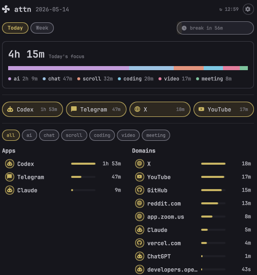
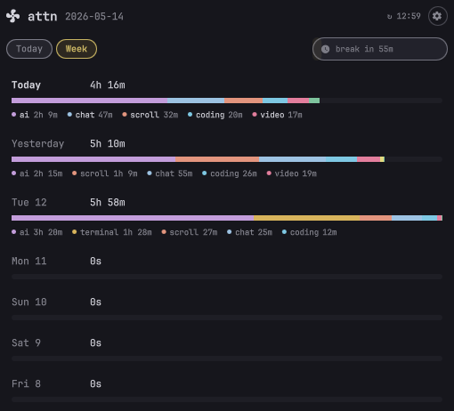
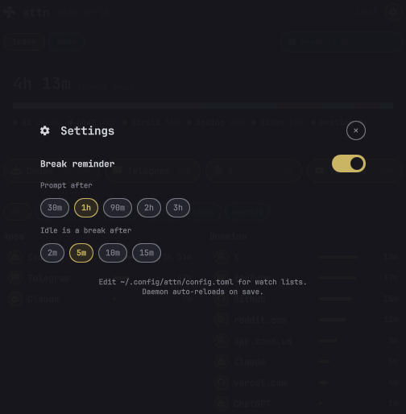
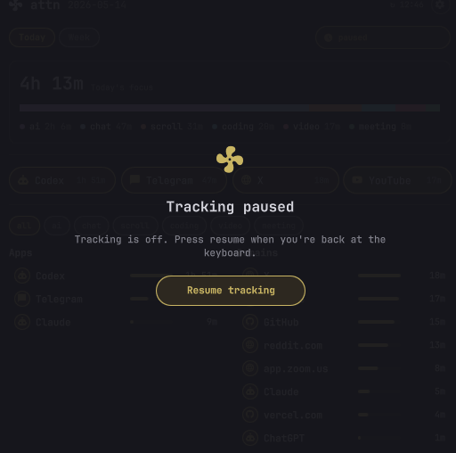

# attn

A local attention ledger for Wayland (Niri, Hyprland, Sway, river) and [Quickshell](https://quickshell.org/).

`attn` measures where focus actually goes across applications, and which domains receive browser time (Chromium-family and Firefox-family). It's intentionally observational: no blocking, no streaks. It records local evidence, surfaces a discreet indicator in your bar, and optionally pings a desktop notification when a break is overdue or a daily budget is reached.

> **Status:** V1, single-user, NixOS-tested with Niri + Quickshell, also runs on Hyprland, Sway, and river via the `focus_source.kind` config. The Rust daemon and CLI build on any Linux with `/proc`; the Quickshell widget is the optional UI layer.



| Week | Settings | Paused |
|:----:|:--------:|:------:|
|  |  |  |


## What it tracks

- **App focus time** from your compositor's IPC (Niri, Hyprland, Sway, river — auto-detected, overridable via `focus_source.kind`).
- **Terminal subprocess**. If you're in `ghostty` and run `claude`, the daemon attributes time to `claude`, not `ghostty`. Detection uses (1) window title, (2) live tmux query if tmux is in the descendant tree, (3) a `/proc` descendant walk with start-time tiebreak.
- **Browser domain time** for Chromium-family (Helium, Brave, Chrome, Chromium) and Firefox-family (Firefox, Zen, LibreWolf, Floorp) browsers, clipped to intervals where that browser actually had focus. Domain time can never grow while the browser is unfocused.
- **Idle handling**. A focused interval that doesn't change for 5 minutes is capped, so an unattended tab doesn't inflate today's total.

## What it doesn't do

No blocking. No alerts. No interventions. No cloud sync. No telemetry. No per-tab live tracking. No AI summaries. No streaks or scores. If you want behavior change, this is the wrong tool. It's a notebook, not a coach.

## Privacy

All state is local. The SQLite ledger lives at `~/.local/state/attn/attn.sqlite` (mode 0600). The Unix socket lives at `$XDG_RUNTIME_DIR/attn.sock` (user-only). Browser history is snapshot-copied before reading, then deleted. The daemon never reads live against your browser and has no network code path.

## Install

### One-line installer (Linux, x86_64 or aarch64)

Requires a supported Wayland compositor running: [niri](https://github.com/YaLTeR/niri), [Hyprland](https://hyprland.org/), [Sway](https://swaywm.org/), or [river](https://codeberg.org/river/river). Without one, app tracking won't do anything.

```sh
curl -fsSL https://raw.githubusercontent.com/0xPD33/attn/main/scripts/install.sh | sh
```

What it does: fetches the latest GitHub Release tarball, verifies its sha256, places the `attn` binary at `~/.local/bin/attn`, runs `attn init` or `attn init --merge` for the config, and drops a systemd user unit at `~/.config/systemd/user/attn.service`. It does **not** enable or start the service unless you set `ATTN_START=1`.

Environment overrides: `ATTN_VERSION=v0.1.0` to pin a tag, `ATTN_PREFIX=$HOME/bin` for a different install dir, `ATTN_SYSTEMD=0` to skip the systemd unit, `ATTN_START=1` to enable + start the service immediately, `ATTN_SKIP_COMPOSITOR_CHECK=1` to install without a supported compositor.

Verify the binary:

```sh
attn --help
attn doctor
```

### As a Nix flake

```nix
# flake.nix
{
  inputs.attn.url = "github:0xPD33/attn";
  inputs.attn.inputs.nixpkgs.follows = "nixpkgs";

  outputs = { home-manager, attn, ... }: {
    homeConfigurations.you = home-manager.lib.homeManagerConfiguration {
      # ...
      modules = [
        attn.homeManagerModules.default
        ({ ... }: {
          programs.attn = {
            enable = true;
            daemon.enable = true;        # user systemd service
            quickshell.enable = true;    # install AttnIndicator.qml under ~/.config/quickshell/attn/
          };
        })
      ];
    };
  };
}
```

`programs.attn.configText` lets you override the default config inline.

`programs.attn.quickshell.enable` only installs the indicator component. If a separate Home Manager module already owns your entire `~/.config/quickshell` tree, leave this disabled and copy `quickshell/AttnIndicator.qml`, `AttnPopup.qml`, and `AttnRow.qml` into that tree manually.

### Standalone build

```sh
nix develop
cargo build --release
install -m 0755 target/release/attn ~/.local/bin/
```

Or build the flake package directly:

```sh
nix build .#default
./result/bin/attn --help
```

## Configure

```sh
attn init                # writes ~/.config/attn/config.toml from the bundled default
attn init --merge        # add new bundled defaults to an existing config
attn init --force        # overwrite
$EDITOR ~/.config/attn/config.toml
# daemon auto-reloads on save (mtime watch); `attn reload` available as a manual nudge
```

The default config covers the common app IDs and domain lists. **Want to add a category or domain to the shipped defaults so everyone benefits?** The watch lists live in per-category text files (one item per line, `#` comments allowed):

- `config/apps/<category>.txt` - Linux app IDs / executable names
- `config/domains/<category>.txt` - domains for Chromium-family history matching

Edit the relevant file, run `tools/sync-default-config.sh` to regenerate `config/default.toml`, and open a PR. CI verifies the regenerated TOML matches the per-category sources.

Non-list runtime config (paths, intervals, browsers, terminals, breaks) lives in `config/runtime.toml`.

Customize watch lists per category in your own `~/.config/attn/config.toml`:

```toml
poll_interval_secs = 60
idle_after_secs    = 300
socket_path        = "$XDG_RUNTIME_DIR/attn.sock"
state_path         = "~/.local/state/attn/attn.sqlite"

[apps.watch]
coding   = ["code", "cursor", "zed"]
terminal = ["com.mitchellh.ghostty", "wezterm"]
chat     = ["discord", "signal", "slack"]

[domains.watch]
ai      = ["chatgpt.com", "claude.ai", "gemini.google.com"]
scroll  = ["reddit.com", "x.com", "tiktok.com"]
video   = ["youtube.com", "youtu.be", "twitch.tv"]

[browsers.brave]
app_ids       = ["brave-browser", "brave"]
history_paths = ["~/.config/BraveSoftware/Brave-Browser/*/History"]
kind          = "chromium"

[terminals]
poll_secs = 10

[terminals.apps]
ai     = ["claude", "codex", "aichat"]
editor = ["nvim", "vim", "hx", "helix", "emacs"]
```

See [ARCHITECTURE.md](./ARCHITECTURE.md) for the full data model.

## Run

### As a user systemd service (Home Manager)

Set `programs.attn.daemon.enable = true` and Home Manager will register `attn.service` under your user. Start / stop / check it normally:

```sh
systemctl --user status  attn
systemctl --user restart attn
journalctl --user -u attn -f
```

### Manually

```sh
attn daemon
```

## CLI

```
attn daemon              run the long-running collector
attn status --json       print current-day status as JSON (used by Quickshell)
attn reload              reload ~/.config/attn/config.toml without restarting
attn init [--merge|--force]
                         write or update the default config
attn doctor              check compositor IPC, config parsing, state DB, browser DBs, socket
```

Example `status` output:

```json
{
  "date": "2026-05-12",
  "updated_at": "2026-05-12T22:30:00+02:00",
  "watch_seconds": 15563,
  "tracked_seconds": 16928,
  "apps": [
    { "id": "claude",                 "seconds": 1094, "watched": true, "category": "ai" },
    { "id": "com.mitchellh.ghostty",  "seconds": 5285, "watched": true, "category": "terminal" }
  ],
  "domains": [
    { "domain": "github.com", "seconds": 372, "watched": true, "category": "coding" },
    { "domain": "youtube.com", "seconds": 252, "watched": true, "category": "video" }
  ],
  "categories": [
    { "name": "ai",       "seconds": 6979 },
    { "name": "terminal", "seconds": 5285 }
  ]
}
```

## Quickshell widget

Three QML files under `quickshell/`:

- `AttnIndicator.qml`: bar chip. Polls `attn status --json` (fast initial polls, then every 5 s). Dims when stale, brightens when fresh.
- `AttnPopup.qml`: clicking the chip opens a popup with today's totals: a stacked category bar, top items, category filter chips, and side-by-side Apps / Domains lists.
- `AttnRow.qml`: list row used by the popup.

If you used `programs.attn.quickshell.enable = true`, only the indicator is installed. Wire the popup into your own bar manually. The reference wiring lives in the home-manager Quickshell config that owns `Bar.qml` for this project.

## Development

```sh
nix develop
cargo test
cargo build --release
```

The test suite covers focus resolution, terminal subprocess detection, browser snapshot reading, domain attribution, idle capping, watch-list classification, and daily-totals rebuild. Tests use in-memory SQLite.

## License

MIT. See [LICENSE](./LICENSE).
